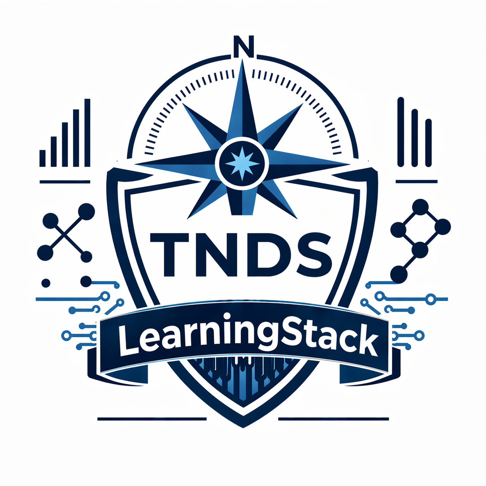

<div align="center">

# LearningStack

### Modular, Multi-Tenant LLM Platform Patterns

[](https://www.python.org)
[](https://www.typescriptlang.org)
[](LICENSE)
[](https://truenorthstrategyops.com)



</div>

---

Operator-grade learning artifacts and starter code for building modular, multi-tenant LLM platforms. Reference patterns, not a framework — copy what fits, leave what doesn't.

## What's in here

| Path | Purpose |
| --- | --- |
| [llm-platform-starter-sets/](llm-platform-starter-sets/) | Python and TypeScript starter runtimes, a module template, and example content packs |
| [LLM_PLATFORM_COMPLETE_LEARNING_MODULE.md](LLM_PLATFORM_COMPLETE_LEARNING_MODULE.md) | End-to-end architecture reference for shared-core, module-based LLM platforms |
| [DECISION ENGINE LEARNING MODULE.md](DECISION%20ENGINE%20LEARNING%20MODULE.md) | Decision engine design and implementation walkthrough |
| [LLM-BUILD-PROMPTS/](LLM-BUILD-PROMPTS/) | Reusable build, review, and audit prompts |

## Why it exists

A worked reference for production-minded LLM platform patterns:

- **Shared-core, multi-client architecture** — one runtime, many tenants, isolated state
- **Module-based orchestration** — pluggable capability modules over a thin core
- **Tenant isolation and redaction-first logging** — no cross-tenant leakage, no PII in logs
- **Staged rollout and governance** — feature flags, canaries, audit trails as defaults

## Quick start

### Python starter

```bash
cd llm-platform-starter-sets/python-starter
pip install -r requirements.txt
python -m app.main
```

### TypeScript starter

```bash
cd llm-platform-starter-sets/typescript-starter
npm install
npm run start
```

## Safety

No real client data, credentials, or private financial records belong in this repo. Examples use synthetic tenants (`Client Alpha`, placeholder IDs). See [CLAUDE.md](CLAUDE.md) for the full non-negotiables.

## License

[MIT](LICENSE)
